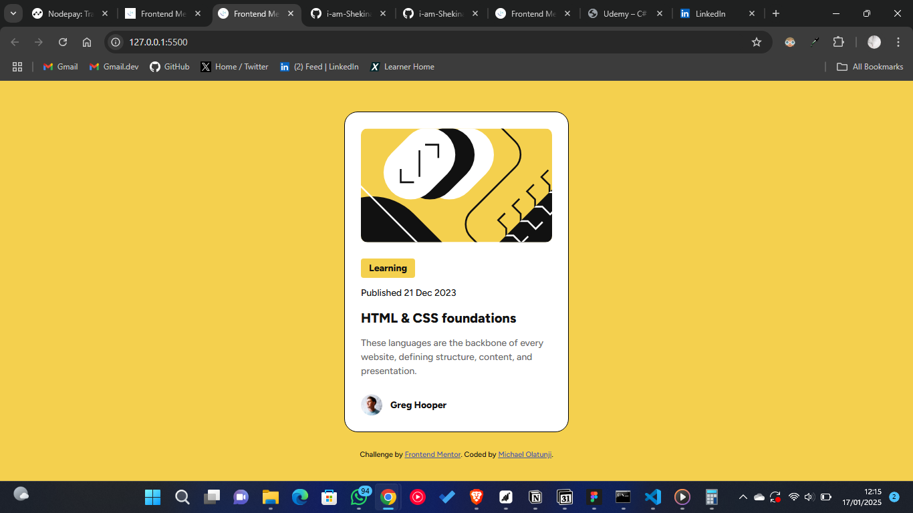

# Frontend Mentor - Blog Preview Card Component Solution

This is my solution to the **[Blog Preview Card component challenge](https://www.frontendmentor.io/learning-paths/getting-started-on-frontend-mentor-XJhRWRREZd/steps/6771c3f6229816307731d8cb/challenge/start)** on Frontend Mentor. Frontend Mentor challenges help developers improve their coding skills by building realistic projects.

---

## Table of Contents

1. [Overview](#overview)  
2. [Screenshot](#screenshot)  
3. [Links](#links)  
4. [My Process](#my-process)  
   - [Built With](#built-with)  
   - [What I Learned](#what-i-learned)  
   - [Continued Development](#continued-development)  
   - [Useful Resources](#useful-resources)  
5. [Author](#author)  
6. [Acknowledgments](#acknowledgments)

---

## Overview

### The Challenge

Users should be able to:

- View the blog preview card component design as closely as possible to the provided mockup.
- Interact with the share button to reveal the social media links.

---

## Screenshot



---

## Links

- [Preview Code](https://github.com/i-am-Shekinah/blog-preview-card)
- [Visit Site](https://i-am-shekinah.github.io/blog-preview-card/)

---

## My Process

### Built With

- Semantic HTML5 markup  
- CSS custom properties
- Flexbox

### What I Learned

I learned more about accessibility and aligning with WCAG (Web Content Accessibility Guidelines). I also learned about using `visually-hidden` classes to hide content for strictly for screen readers.

```css
.visually-hidden {
  position: absolute;
  clip: rect(1px, 1px, 1px, 1px);
}
```


## Author

- **Frontend Mentor Profile:** [Michael Olatunji](https://www.frontendmentor.io/profile/i-am-Shekinah)  
- **LinkedIn Profile:** [Michael Olatunji](https://www.linkedin.com/in/michael-olatunji-75347b247/)  

---


## Acknowledgments

Special thanks to Frontend Mentor for providing this challenge and the community for inspiration!
